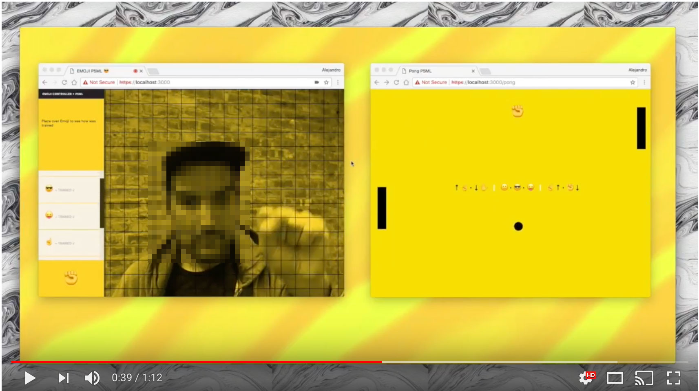
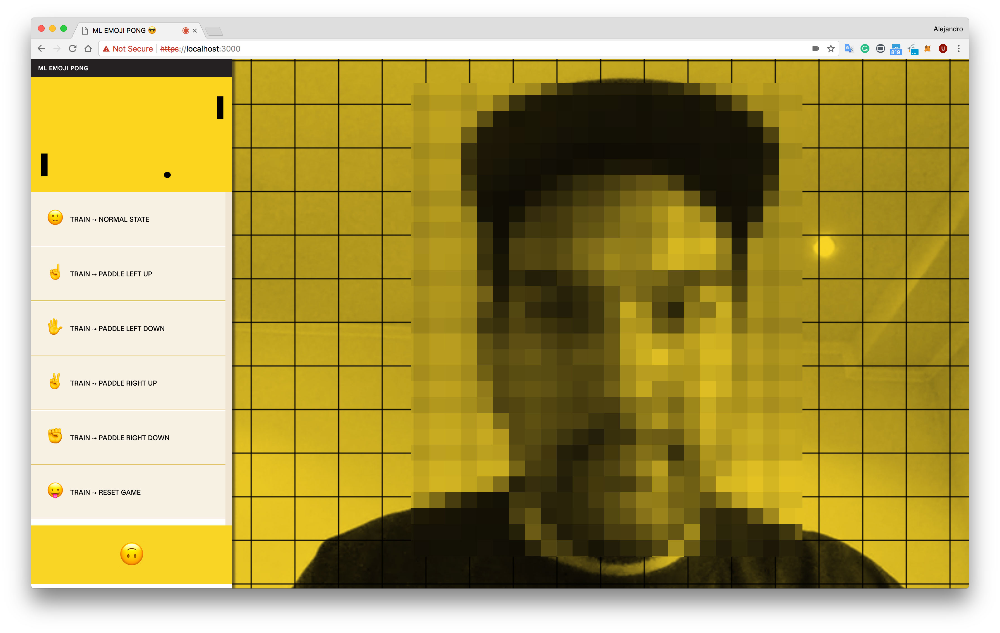

# P5ML Pong Game

A Machine Learning Pong Game to train and play in the browser.

## How it works

P5ML Pong Game uses the P5 DeepLearn library https://github.com/cvalenzuela/p5-deeplearn-js to train the controllers and predict the output.

## Demo

Video Demo version runs in 2 windows browsers and is sending the data through web sockets. (The repo for this project combines the game and the controller in one single page)

### [ML PONG](https://www.youtube.com/watch?v=koZYwOAHmQM&feature=youtu.be)

## Usage

Currently version of the game runs the game and the controller at the same page.*

- Clone Repository.
- Create `private` directory inside of `/server` and add your `cert.pem` and `key.pem` certificates.
- Replace your credentials in the`server.js` file.
- Run `$ npm install`
- Start `$ npm start`

Project will run at port 3000.

## Test

https://am7673.itp.io:3000

## License

MIT
