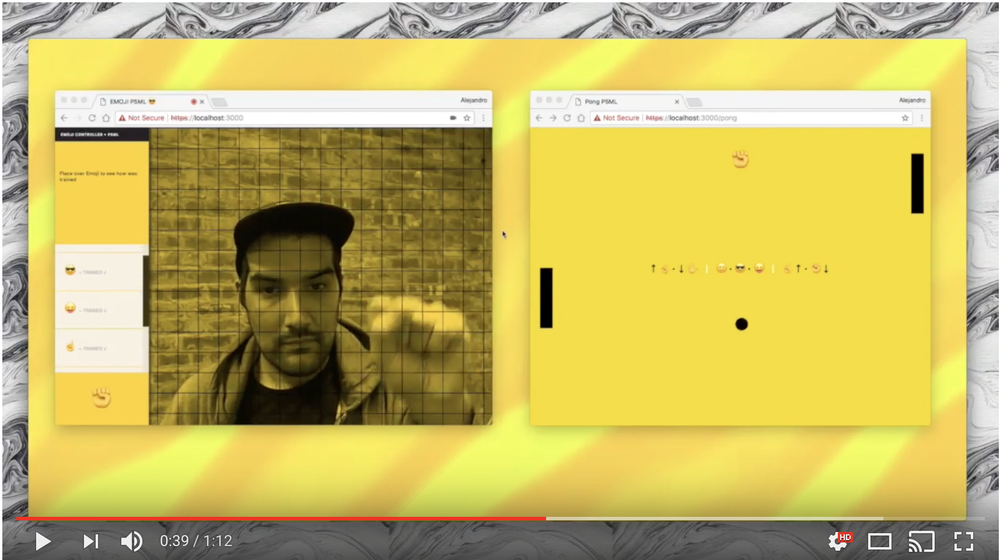

# P5ML Pong Game

A Machine Learning Pong Game to train and play in the browser.


## How it works

P5ML Pong Game uses the P5 deeplearn library https://github.com/cvalenzuela/p5-deeplearn-js to train and predict the controllers to play the game.


## Demos

### [ML PONG](https://www.youtube.com/watch?v=koZYwOAHmQM&feature=youtu.be)



## Usage
```
$ npm install
$ npm start
```

## License

MIT
